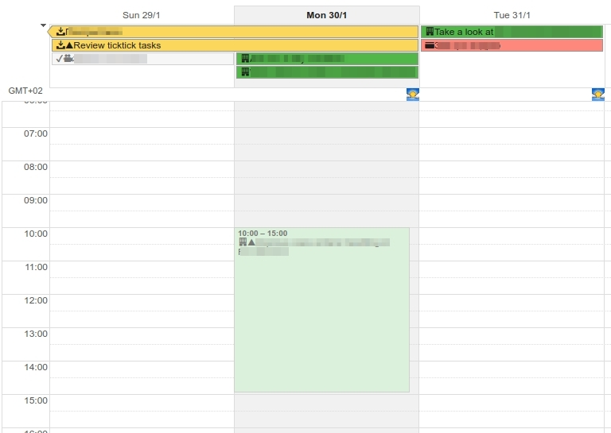

# TuckTuck
Better calendar integration between TickTick and Google Calendar.

# Requirements
* One-way synchronization. Changes done via TickTick should be visible in Google Calendar and not wise versa.
* TuckTuck should check and/or create `tucktuck` calendar in Google Calendar.
* Calendar should be modifiable in order to allow usage of more than one color. TODO add link on reference
* Titles of completed events should be crossed and should contain ✔️ sign at the beginning.
* Event title should contains priority sign (if specified). One of: 🔻, 🔺, ⚫️.
* Event title should contains emoji signs if any present in projects name.
* There should be mapping between TickTick and Google Calendar colors.
* Event description should contains TickTick task id in next format @[task_id=9888f6b12214dds9f215]

# Dependencies

# Usage

# TickTick api
